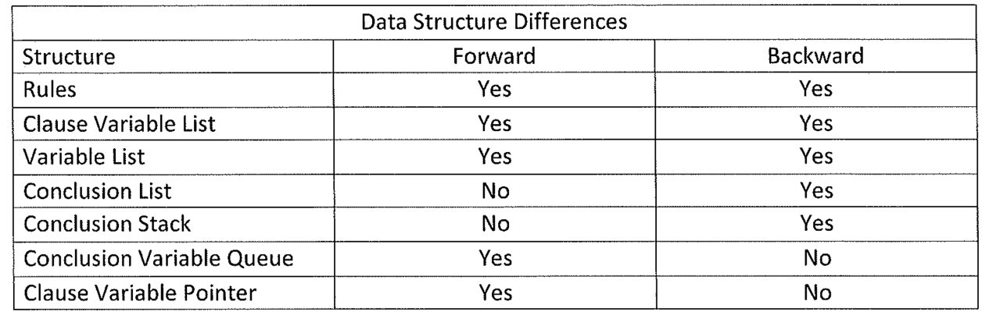
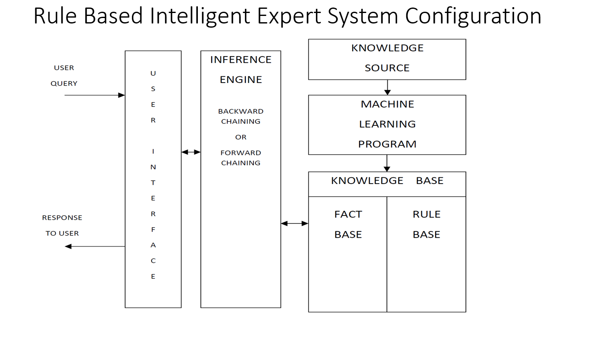
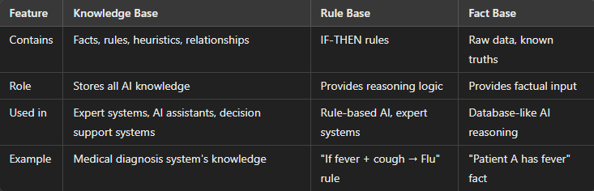
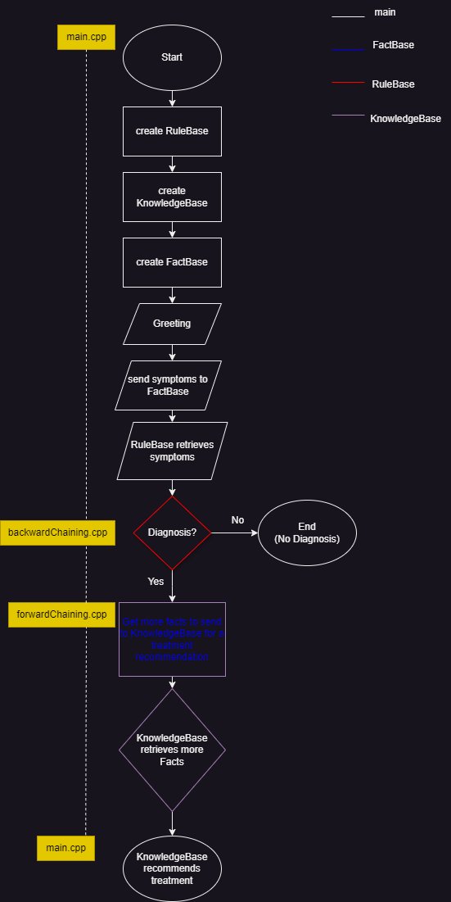
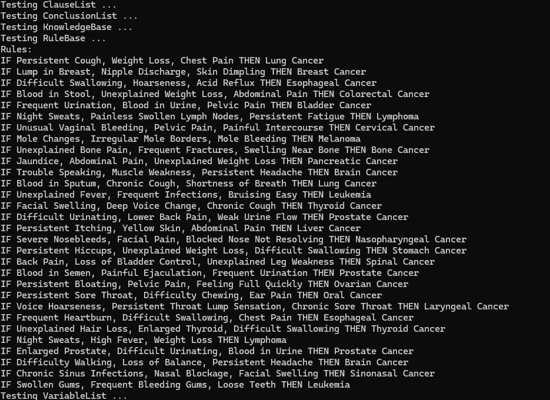

"Philosophy ought to imitate the successful sciences in its methods, so far as to proceed only from tangible premisses which can be
subjected to careful scrutiny, and to trust rather to the multitude and variety of its arguments than to the conclusiveness
of any one. Its reasoning should not form a chain which is no stronger than its weakest link, but a cable whose fibres may
be ever so slender, provided they are sufficiently numerous and intimately connected."   ( "Some Consequences of Four Incapacities", Charles S. Peirce )   
I used to always say, "We live in the best time because, with computers, we have the world at our fingertips."
 
While I still believe that is very true, I now give a more accurate depiction instead:  
"We live in the best time because we have infinite knowledge at our fingertips."

My goal is to develop this ai model in a way that 
i can implement other types of queries such as advice referencing any material e.g. cancer diagnosis, treatments, documentation/researches, animal diagnosis/treatments, The Holy Bible references, and so much more.

Humans are active participants in knowledge-making. And our dynamic and interactive inquiries based on experience provides us our knowledge which is what adds to our rule set and fact set. I am developing a fact/rule based artificial intelligence program which uses a knowledge base. Over time, I will develop the knowledge base to be trained based on inquiries from deep learning algorithms as well as developer-set rules.

“In **rule-based AI**, the **fact base** provides input, the **rule base** processes it, and the **knowledge base** contains all necessary relationships.”

# Table of Contents
[ruleBase](/ai-cancer-treatment/ruleBase/)  
[knowledgeBase](/ai-cancer-treatment/knowledgeBase/) creates rules using facts (will use a Rule Base and and a Fact Base)  

[forwardChaining](/ai-cancer-treatment/forwardChaining/)  
[backwardChaining](/ai-cancer-treatment/backwardChaining/)  

# Driver flow

# Rules
  

# Backward Chaining
  

# Testing backwardChaining::userValidClauseVect and backwardChaining::generateSubsets
  

# Testing backwardChaining.cpp's Determination of Possible Conclusions

# Testing backwardChaining.cpp's Diagnosis

# Testing decisionTree.h

