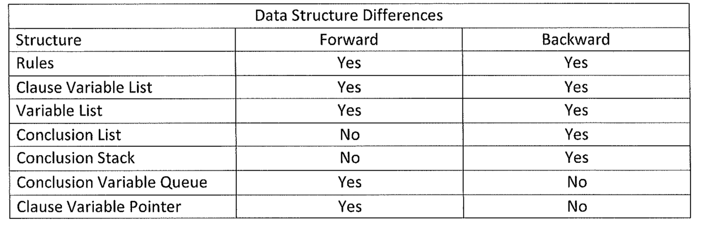
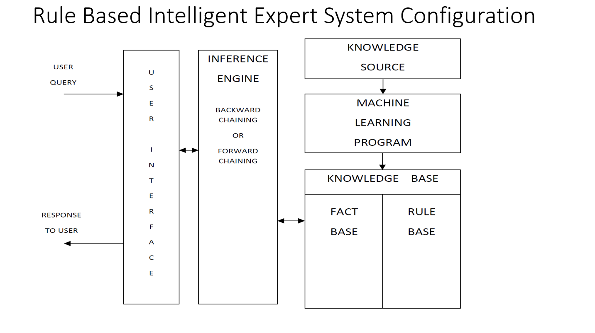
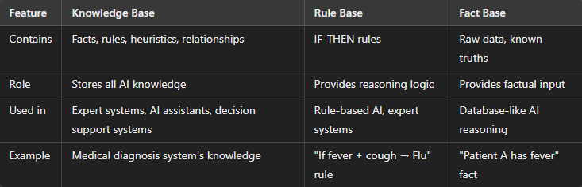
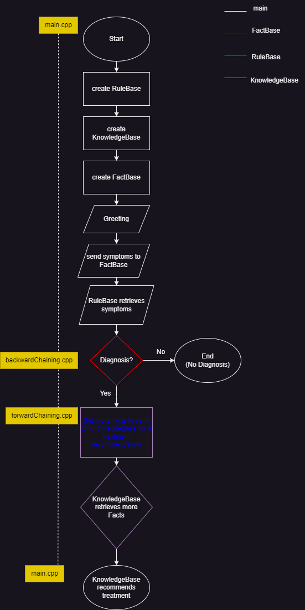
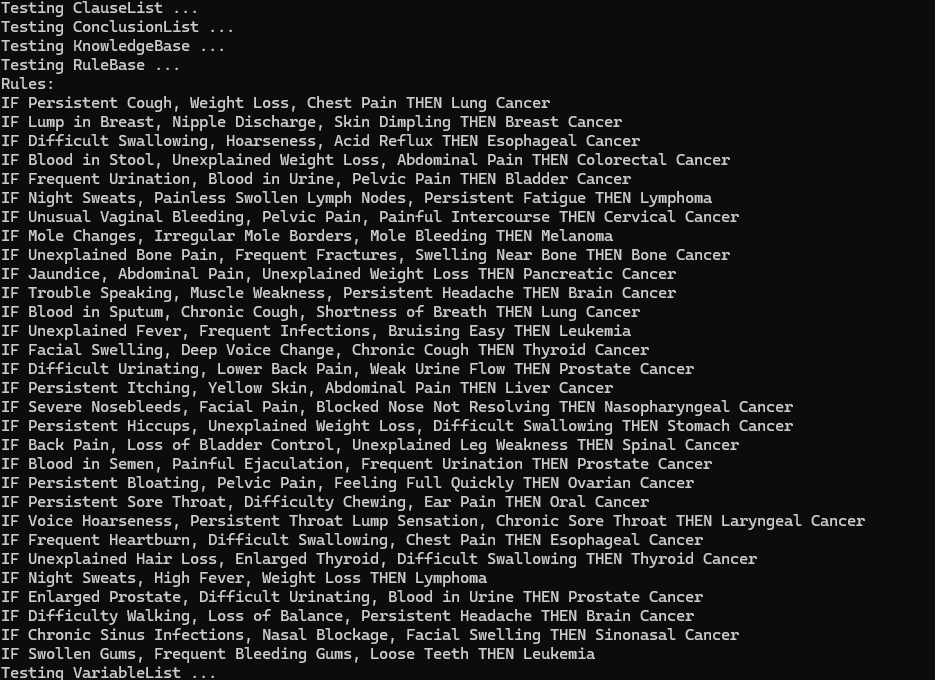
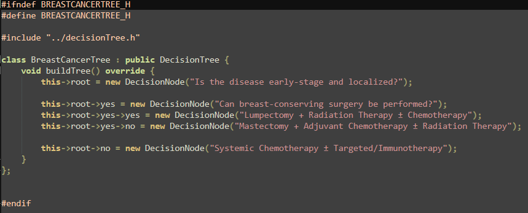

"Philosophy ought to imitate the successful sciences in its methods, so far as to proceed only from tangible premisses which can be
subjected to careful scrutiny, and to trust rather to the multitude and variety of its arguments than to the conclusiveness
of any one. Its reasoning should not form a chain which is no stronger than its weakest link, but a cable whose fibres may
be ever so slender, provided they are sufficiently numerous and intimately connected." <br> ( "Some Consequences of Four Incapacities", Charles S. Peirce ) <br><br>
I used to always say, "We live in the best time because, with computers, we have the world at our fingertips."
 
While I still believe that is very true, I now give a more accurate depiction instead:<br><br>
"We live in the best time because we have infinite knowledge at our fingertips."

My goal is to develop this ai model in a way that 
i can implement other types of queries such as advice referencing any material e.g. cancer diagnosis, treatments, documentation/researches, animal diagnosis/treatments, The Holy Bible references, and so much more.

Humans are active participants in knowledge-making. And our dynamic and interactive inquiries based on experience provides us our knowledge which is what adds to our rule set and fact set. I am developing a fact/rule based artificial intelligence program which uses a knowledge base. Over time, I will develop the knowledge base to be trained based on inquiries from deep learning algorithms as well as developer-set rules.

“In **rule-based AI**, the **fact base** provides input, the **rule base** processes it, and the **knowledge base** contains all necessary relationships.”

# Table of Contents
[ruleBase](/ai-cancer-treatment/ruleBase/) <br>
[knowledgeBase](/ai-cancer-treatment/knowledgeBase/) creates rules using facts (will use a Rule Base and and a Fact Base) <br>

[forwardChaining](/ai-cancer-treatment/forwardChaining/) <br>
[backwardChaining](/ai-cancer-treatment/backwardChaining/) <br>






# Driver flow


# Rules
 <br>

# Backward Chaining
 <br>

# Testing backwardChaining::userValidClauseVect and backwardChaining::generateSubsets
 <br>

# Testing backwardChaining.cpp's Determination of Possible Conclusions


# Testing backwardChaining.cpp's Diagnosis


# Testing decisionTree.h


# Testing treeTypes.h
Each Conclusion inherits and overrides a Global Static Decision Tree for polymorphic capabilities:<br><br>


---

# Project Overview

The **AI Cancer Treatment Expert System** is a rule-based intelligent system written in C++ that assists in cancer diagnosis and personalized treatment planning through two distinct AI reasoning strategies:

1. **Backward Chaining** — Goal-driven inference. Given a set of patient symptoms, the system works backward from possible diagnoses (conclusions) through its rule base to determine which cancer type best matches.
2. **Forward Chaining / Decision Trees** — Data-driven inference. Once a diagnosis is reached, the system walks the patient through a yes/no decision tree to produce a personalized treatment recommendation.

The system currently supports **22 cancer types** and **72 distinct symptoms** encoded in its knowledge base.

---

# Architecture

```
┌─────────────────────────────────────────────────────────────────┐
│                        main.cpp  (Driver)                       │
│                                                                 │
│   STEP 1 — Backward Chaining (Diagnosis)                        │
│   ┌───────────────┐   ┌──────────────┐   ┌──────────────────┐  │
│   │  User Symptoms│──▶│  Rule Base   │──▶│  Diagnosis       │  │
│   │  (ClauseTypes)│   │  (30 rules)  │   │  (ConclusionType)│  │
│   └───────────────┘   └──────────────┘   └──────────────────┘  │
│                                                  │              │
│   STEP 2 — Forward Chaining (Treatment)          ▼              │
│                                   ┌──────────────────────────┐  │
│                                   │  Decision Tree           │  │
│                                   │  (LungCancerTree /       │  │
│                                   │   BreastCancerTree / …)  │  │
│                                   └──────────────────────────┘  │
└─────────────────────────────────────────────────────────────────┘
```

| Component | File(s) | Role |
|---|---|---|
| **Rule Base** | `ruleBase/ruleBase.h`, `ruleBase/ruleBase.cpp` | Stores IF-THEN rules mapping symptom sets to diagnoses |
| **Fact Base** | `factBase/factBase.h`, `factBase/factBase.cpp` | Holds runtime patient facts |
| **Knowledge Base** | `knowledgeBase/knowledgeBase.h`, `knowledgeBase/knowledgeBase.cpp` | Integrates rule + fact bases |
| **Backward Chaining** | `backwardChaining/backwardChaining.h`, `.cpp` | Subset-search diagnosis engine |
| **Forward Chaining** | `forwardChaining/forwardChaining.h`, `.cpp` | Data-driven treatment selector |
| **Decision Tree** | `decisionTree/decisionTree.h`, `.cpp` | Base class + `traverseTree()` |
| **Tree Types** | `decisionTree/treeTypes/LungCancerTree.h`, `BreastCancerTree.h` | Concrete per-cancer decision trees |
| **Variable Lists** | `variableList/clauseTypes.h`, `conclusionTypes.h`, `responseTypes.h` | Enumerations for symptoms, diagnoses, treatments |
| **Main Driver** | `main.cpp` | End-to-end pipeline orchestration |

---

# Build & Run

### Requirements
- C++11-compatible compiler (e.g., `g++ 7+`)

### Compile
```bash
g++ main.cpp \
    ruleBase/ruleBase.cpp \
    factBase/factBase.cpp \
    decisionTree/decisionTree.cpp \
    -o cancer-expert-system -std=c++11
```

### Run
```bash
./cancer-expert-system
```

---

# Example Session

```
======================================================
   AI Cancer Treatment Expert System
   Rule-Based Intelligent Diagnosis & Treatment
======================================================

--- STEP 1: DIAGNOSIS (Backward Chaining) ---
Enter the patient's symptoms as comma-separated values.
Example: persistent cough, weight loss, chest pain

Symptoms: persistent cough, weight loss, chest pain

Recognized symptoms (3):
  - Persistent Cough
  - Weight Loss
  - Chest Pain

Evaluating 8 symptom subsets against the rule base...

DIAGNOSIS: Lung Cancer

--- STANDARD TREATMENT OPTIONS ---
Surgery, chemotherapy, radiation therapy, targeted therapy, immunotherapy.

--- STEP 2: PERSONALIZED TREATMENT PLAN (Forward Chaining) ---
Answer the questions below (yes/no) for a personalized
treatment recommendation:

Is the cancer localized? (yes/no): no
Does the tumor have actionable mutations? (yes/no): no
Immunotherapy +/- Chemotherapy (yes/no): yes
Final Recommendation: Immunotherapy +/- Chemotherapy

======================================================
  DISCLAIMER: This system is for educational purposes
  only. Always consult a qualified medical professional
  for actual diagnosis and treatment decisions.
======================================================
```

---

# Supported Cancer Types

| # | Cancer Type | Key Diagnostic Symptoms |
|---|---|---|
| 1 | Lung Cancer | Persistent Cough, Weight Loss, Chest Pain |
| 2 | Breast Cancer | Lump in Breast, Nipple Discharge, Skin Dimpling |
| 3 | Esophageal Cancer | Difficult Swallowing, Hoarseness, Acid Reflux |
| 4 | Colorectal Cancer | Blood in Stool, Unexplained Weight Loss, Abdominal Pain |
| 5 | Bladder Cancer | Frequent Urination, Blood in Urine, Pelvic Pain |
| 6 | Lymphoma | Night Sweats, Painless Swollen Lymph Nodes, Persistent Fatigue |
| 7 | Cervical Cancer | Unusual Vaginal Bleeding, Pelvic Pain, Painful Intercourse |
| 8 | Melanoma | Mole Changes, Irregular Mole Borders, Mole Bleeding |
| 9 | Bone Cancer | Unexplained Bone Pain, Frequent Fractures, Swelling Near Bone |
| 10 | Pancreatic Cancer | Jaundice, Abdominal Pain, Unexplained Weight Loss |
| 11 | Brain Cancer | Trouble Speaking, Muscle Weakness, Persistent Headache |
| 12 | Leukemia | Unexplained Fever, Frequent Infections, Bruising Easy |
| 13 | Thyroid Cancer | Facial Swelling, Deep Voice Change, Chronic Cough |
| 14 | Prostate Cancer | Difficult Urinating, Lower Back Pain, Weak Urine Flow |
| 15 | Liver Cancer | Persistent Itching, Yellow Skin, Abdominal Pain |
| 16 | Nasopharyngeal Cancer | Severe Nosebleeds, Facial Pain, Blocked Nose Not Resolving |
| 17 | Stomach Cancer | Persistent Hiccups, Unexplained Weight Loss, Difficult Swallowing |
| 18 | Spinal Cancer | Back Pain, Loss of Bladder Control, Unexplained Leg Weakness |
| 19 | Ovarian Cancer | Persistent Bloating, Pelvic Pain, Feeling Full Quickly |
| 20 | Oral Cancer | Persistent Sore Throat, Difficulty Chewing, Ear Pain |
| 21 | Laryngeal Cancer | Voice Hoarseness, Persistent Throat Lump Sensation, Chronic Sore Throat |
| 22 | Sinonasal Cancer | Chronic Sinus Infections, Nasal Blockage, Facial Swelling |

---

# Decision Tree Paths

Decision trees provide personalized treatment recommendations through a series of yes/no clinical questions after a diagnosis is made.

### Lung Cancer Tree
```
Is the cancer localized?
├── yes → Is the tumor resectable?
│         ├── yes → Surgery + Adjuvant Chemotherapy +/- Radiation Therapy
│         └── no  → Definitive Chemoradiation
└── no  → Does the tumor have actionable mutations?
          ├── yes → Targeted Therapy
          └── no  → Immunotherapy +/- Chemotherapy
```

### Breast Cancer Tree
```
Is the disease early-stage and localized?
├── yes → Can breast-conserving surgery be performed?
│         ├── yes → Lumpectomy + Radiation Therapy +/- Chemotherapy
│         └── no  → Mastectomy + Adjuvant Chemotherapy +/- Radiation Therapy
└── no  → Systemic Chemotherapy +/- Targeted/Immunotherapy
```

---

# Disclaimer

> This system is intended **for educational and research purposes only**.  
> It does not constitute medical advice and must not be used as a substitute for professional clinical judgment.  
> Always consult a qualified oncologist or medical professional for actual diagnosis and treatment decisions.
